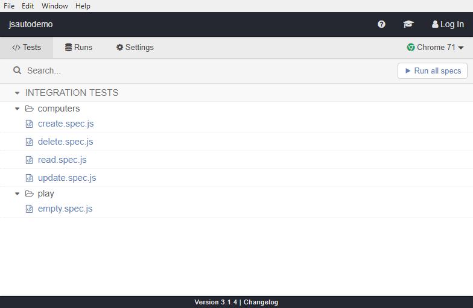
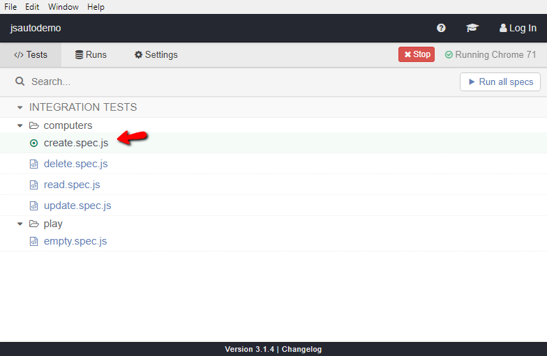
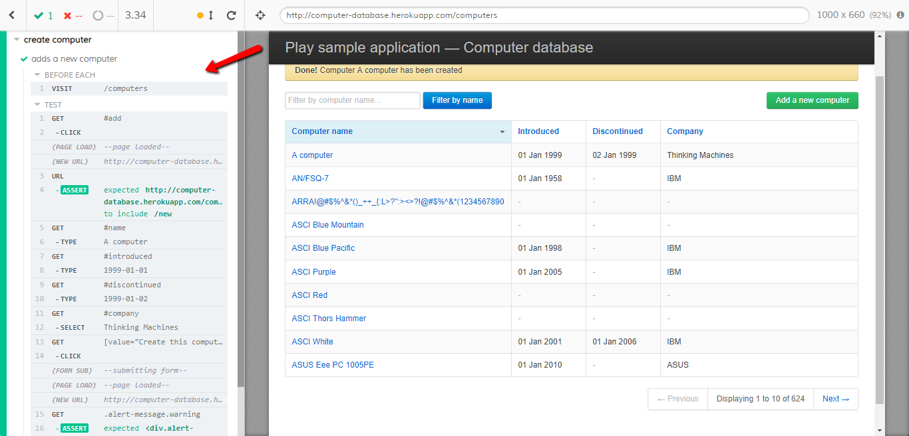
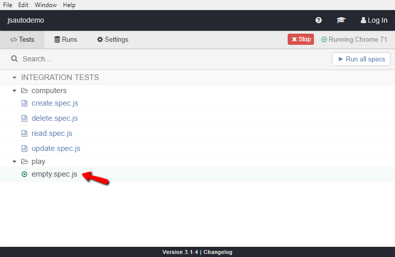
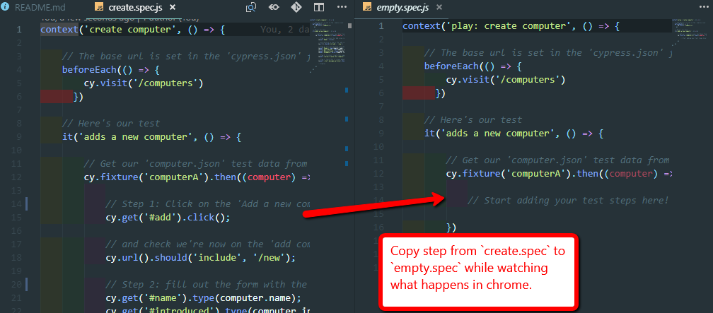

# CRUD TEST CASES: Online Database

This readme is split into the following sections:

1. Automation Tests using Cypress
2. Manual Exploratory Tests 

***PLEASE NOTE:*** In an ideal world we would also cover our requirements with Domain level tests (at the server level).

***ASSUMPTIONS:*** There are no requirements, therefore only basic CRUD testing has been performed.

## Project Set up and Install

1. You must have `node` and `npm` (which comes bundled with `node`) installed on your machine, any version above `8.9.0` will be fine.
2. Clone this project and then run `npm install` to download the dependencies.
3. Open with your favorite JavaScript IDE (I recommend VSCode or IntelliJ Pro as we'll need the AsciiDoc extension later).

***NOTE:*** Take a look at the `package.json` file. You'll notice that there is only one dependency. This makes `Cypress` very stable and easy to maintain.

## Cypress Tests

One way to run the Cypress tests is by using the test runner. In your terminal navigate to the project root directory and run:

`npm run cypress:open`

The test runner will open and look like this:

Click on `Run all specs`.

This will run the `create`, `delete`, `read` and `update` tests (or `specs`) that can be found in: `cypress > integration > computers`

These can be run in any order or run individually (if they need a `computer` to delete, then they create one from test data).

These run FAST. On my laptop these four UI tests run in 9 seconds. This means that 400 user journey tests like these would take 15 minutes, which isn't bad. 

Take a look at the tests, they are commented (but not very well - I ran out of time!)

Now click on the `create` test in the Cypress Runner.

Drag the `Chrome` window that opens to a different screen if you have two screens. On the left, you'll see all the test steps. 

Click on the steps and you'll see chrome step back in time to the point in the test you've clicked on.

Now click on the `empty.spec.js` test in the runner.

Chrome will change to the empty test.

Now return to VSCode, while leaving everything else open. Copy the code from `Step 1` in the `create.spec.js` test into the `empty.spec.js` test, while keeping an eye on the open `Chrome` browser.

You'll see that the test updates in real time and runs in the browser.

Add more Steps and see these run in the browser also.

As you write your test, it runs in the browser in real time. As you type, you can see if you made any errors or mistakes, or even if the test will pass or fail at any point.

## Why Cypress?

Cypress is one of a new breed of Test Automation tools that are helping the industry break free from the stranglehold of `selenium`. The tests run in the browser, so you don't need `drivers` or `selenium servers` connecting by the `wire` protocol. They're much faster, much more powerful and incredibly robust and reliable.

It can also be incorporated into your application project structure.

Cypress also allows you to stub out your server, send `before` pre-reqs as HTTP requests and lots lots more. It's very useful for devs also. I also love the error messages, which are helpful and informative, unlike most tools.

[BDD Feature Files with Gherkin Syntax](https://www.npmjs.com/package/cypress-cucumber-preprocessor) is also possible with Cypress, but I didn't have time to set it up here. 

The only disadvantage is that it currently only supports Chrome, but a wider browser support is planned for the end of the year.

[TestCafe](https://github.com/DevExpress/testcafe) is another (non-selenium) automation test tool which is gathering a lot of praise. It does support cross-browser testing and can be used with `Grunt` and `Gulp` if you need to inject the database with test data before running your tests. Cypress can only do this by running `batch` or `shell` scripts on your computer.

## Exploratory (Manual) Tests

***NOTE:*** Please install the latest `AsciiDoc` extension (by João Pinto) in VSCode in order to view the formatted version of these files.

The exploratory tests can be found in `docs > exploratory_tests > computer_crud > create_computer_record.adoc`. In order to view the AsciiDoc, press `ctrl+shift+v` and the document will be generated.

This file contains the `record` of the exploratory testing that has taken place. I've put a table and some short explanations in here as an example. I've only created a record for `creating` a computer, but there will also be records for exploratory testing around `deleting`, `updating` and `reading` a computer and any other user journeys.

In the `docs > exploratory_tests > guides` folder, I've also included a `tools&techniques.adoc` file to help exploratory testers doing their job, and made some notes in there as an example. It is a living document, so this will grow as more knowledge is shared/added.

### Why AsciiDoc?

I've used AsciiDoc as it ensures that the records and guides are under code control and maintained in the project. It can also be easily exported into `PDF`, `HTML` or many other formats for review or reporting and is more powerful that Markdown.

`Living documentation` ensures that no-one is afraid to make changes or improvements are the project develops.